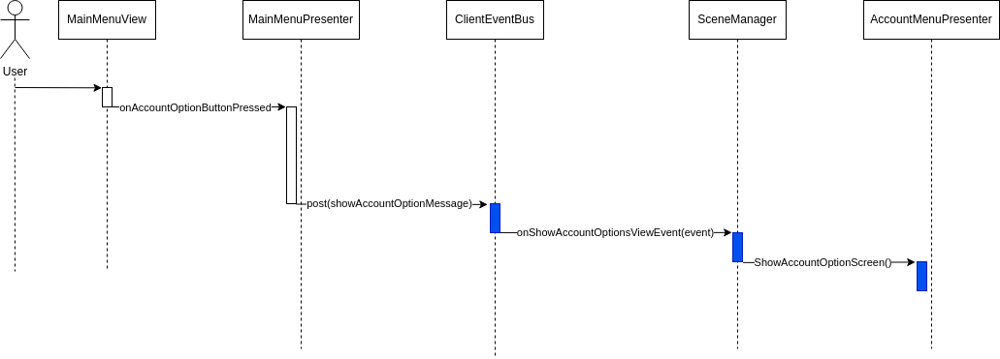

# Beispiel	


Das [Hauptmenü](#linkchapter) ist in acht gleichgroße Buttons aufgeteilt, diese sind mit einem roten Hintergrund und einer silbernen Schrift hinterlegt. Die Anordnung der Buttons ist zentriert und befindet sich unterhalb der Spieleüberschrift. Als Hintergrundbild haben wir eine Spielfeldkarte ausgewählt, die somit einen ersten Eindruck vom Spiel erzeugen soll.

Befehl:

`sudo apt update`

Picture:



```java
acountButtonPressed()
    userService.updateUser();
    int a;
``` 

```py
def func():
    var = 1
```  

# LinkChapter	
Das Hauptmenüfenster begrüßt den User mit seinem Namen und lässt sich nicht maximieren.
....


# Hauptmenü	
17.12.22


Das Hauptmenü ist in acht gleichgroße Buttons aufgeteilt, diese sind mit einem roten Hintergrund und einer silbernen Schrift hinterlegt. Die Anordnung der Buttons ist zentriert und befindet sich unterhalb der Spieleüberschrift. Als Hintergrundbild haben wir eine Spielfeldkarte ausgewählt, die somit einen ersten Eindruck vom Spiel erzeugen soll.

Das Hauptmenüfenster begrüßt den User mit seinem Namen und lässt sich nicht maximieren.

Jeder Button besitzt eine Funktion, die Anhand seiner Namensgebung eine intuitive Handhabung mit dem Hauptmenü ermöglicht. Der „Singleplayer“ – Button ermöglicht den Übergang in ein neues Fenster, indem eine Lobby erstellt werden kann, welche ausschließlich aus „Bots“, also künstlich intelligenten Mitspielern und dem eingeloggten User besteht.

Mithilfe des „Multiplayer“ – Buttons wird ebenfalls ein Wechsel in die Lobbyerstellung erzeugt, hierbei lassen sich weitere Spieleinstellungen vornehmen und der Gruppenchat nutzen. Weitere Informationen wie Funktionen, Eigenschaften und Einstellungen werden unter dem Punkt „Lobby / siehe Seite…..“ beschrieben.

Allgemeine Spieleinstellungen lassen sich unter dem Button „Settings“ wiederfinden.

Alle Änderungen, die den eingeloggten Account betreffen wie z.B. das Passwort, die E-Mail zurücksetzen oder den Account löschen, lassen sich durch den Fensterwechsel mit dem Button „Account“ durchführen.

Unter dem Button „Credits“ findet man alle Ersteller bzw. Entwickler des Spiels „RoboRally“ für das Softwareprojekt im Jahr 2022 / 2023.

Damit jeder User sich mit den Spielregeln vertraut machen kann, existiert ein Regelwerk unter dem Button „Game rules“. Dort lassen sich alle Regeln für den Spieler, die Spielerinn nachlesen und gegebenenfalls Tipps und Tricks recherchieren.

Der Button „Logout“ dient dem Ausloggen des derzeit eingeloggten Users und verweist diesen wieder in das Login-Fenster. Um das gesamte Spiel schließen zu können, haben wir einen „Exit“ – Button an unterster Stelle unsere Top-Down- Anordnung positioniert.


# Lobby

# So weiter