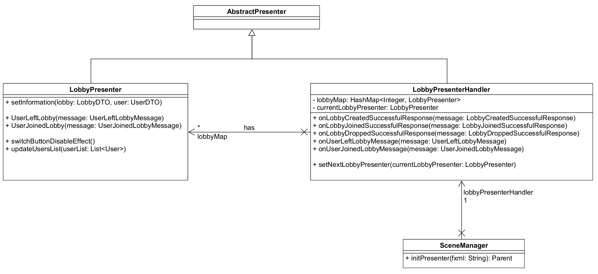
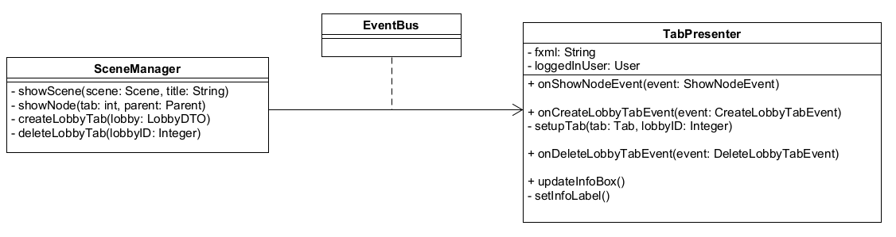

# BITTE BEACHTEN
**
Bitte schreibt in dem jeweiligen Dokument eure Dokumentation rein, damit wir das alles sortiert haben und nicht kreuz und quer.
Sonst könnt ihr mich gerne fragen, wenn ihr Fragen zum Markdown habt oder zur Dokumentation.
Wenn ihr die Dokumentation geschrieben habt, dann fügt Tommy bitte als Reviewer hinzu.
**

**
In diesem Abschnitt sollen alle Dokumentationen bezüglich des Clients rein.
Das bedeutet SceneManager, ClientApp, Main, Lobby und alles Weitere was zukünftig hinzugefügt wird.
**

# Main
17.12.22

Das Hauptmenü ist in acht gleich große Buttons aufgeteilt, diese sind mit einem roten Hintergrund und einer silbernen Schrift hinterlegt. Die Anordnung der Buttons ist zentriert und befindet sich unterhalb der Spielüberschrift. Als Hintergrundbild haben wir eine Spielfeldkarte ausgewählt, die somit einen ersten Eindruck vom Spiel erzeugen soll.

Das Hauptmenüfenster begrüßt den User mit seinem Namen und lässt sich nicht maximieren.

Jeder Button besitzt eine Funktion, die Anhand seiner Namensgebung eine intuitive Handhabung mit dem Hauptmenü ermöglicht. Der „Singleplayer“ – Button ermöglicht den Übergang in ein neues Fenster, indem eine Lobby erstellt werden kann, welche ausschließlich aus „Bots“, also künstlich intelligenten Mitspielern und dem eingeloggten User besteht.

Mithilfe des „Multiplayer“ – Buttons wird ebenfalls ein Wechsel in die Lobbyerstellung erzeugt, hierbei lassen sich weitere Spieleinstellungen vornehmen und der Gruppenchat nutzen. Weitere Informationen wie Funktionen, Eigenschaften und Einstellungen werden unter dem Punkt „Lobby / siehe Seite…..“ beschrieben.

Allgemeine Spieleinstellungen lassen sich unter dem Button „Settings“ wiederfinden.

Alle Änderungen, die den eingeloggten Account betreffen wie z.B. das Passwort, die E-Mail zurücksetzen oder den Account löschen, lassen sich durch den Fensterwechsel mit dem Button „Account“ durchführen.

Unter dem Button „Credits“ findet man alle Ersteller bzw. Entwickler des Spiels „RoboRally“ für das Softwareprojekt im Jahr 2022 / 2023.

Damit jeder User sich mit den Spielregeln vertraut machen kann, existiert ein Regelwerk unter dem Button „Game rules“. Dort lassen sich alle Regeln für den Spieler, die Spielerin nachlesen und gegebenenfalls Tipps und Tricks recherchieren.

Der Button „Logout“ dient dem Ausloggen des derzeit eingeloggten Users und verweist diesen wieder in das Login-Fenster. Um das gesamte Spiel schließen zu können, haben wir einen „Exit“–Button an unterster Stelle unsere Top-Down-Anordnung positioniert.

# Lobby
20.01 Moritz Scheer

Im Hauptmenü gibt es zum einen die Möglichkeit eine Singleplayer Lobby zu erstellen mithilfe des Singleplayer Buttons. Diese erstellt eine private Lobby automatisch ohne ein Password und als Name wird Singleplayer benutzt. diese Lobby kann kein anderer sehen und ist nur für den einen Nutzer zugänglich.

Der Button Multiplayer öffnet die JoinOrCreateView. Dort werden alle öffentlichen Lobbies angezeigt, bei denen der User nicht in der Lobby ist. Zusätzlich werden in der Tabelle Informationen angezeigt über die Lobby wie zum Beispiel der Name der Lobby oder die Spieleranzahl. Von hier aus kann entweder eine neue Lobby erstellt werden oder einer Lobby beigetreten werden durch doppelklick oder durch einen Join Lobby Button. Wenn eine neue Lobby erstellt werden, soll wird ein neues Fenster geöffnet, welcher einen Input für das gewünschte Password und Namen beinhaltet. Ebenso wird ein Fenster geöffnet, wenn einer Lobby beigetreten werden soll, um das benötigte Password abzufragen. Wenn alle Bedingungen richtig sind, dann wird ein neuer Tab geöffnet für die Lobby.

Die Umsetzung der Lobby wird mithilfe eines LobbyPresenterHandler realisiert. Dieser erhält jedes Mal, wenn einer Lobby beigetreten oder erstellt wird einen LobbyPresenter vom SceneManager und speichert diesen zusammen mit einer lobbyID als Schlüsselwert in eine HashMap. Ebenso empfängt dieser alle Lobby bezogene Responses und Messages und ruft die Methoden in dem LobbyPresenter auf, mit derselben lobbyID. Dadurch wird garantiert, dass nur der LobbyPresenter die Nachricht erhält, für die die Nachricht auch gedacht wurde. Beim Erstellen oder beitreten einer Lobby wird ein LobbyPresenter in die HashMap gespeichert und wenn eine Lobby verlassen wird, wird diese aus der HashMap gelöscht.

# ClientApp

# SceneManager
20.01 Moritz Scheer

Im SceneManager wird die LoginView, die RegistrationView und die TabView als Scene abgespeichert. Alle restlichen Views werden als Parent Objekt abgespeichert und bei Bedarf an den TabPresenter übergeben. Wenn zum Beispiel ein neuer Tab geöffnet werden soll, wird der Inhalt des Tabs mit diesem Parent Objekt geladen. Beim Start des Programms werden alle Views geladen und abgespeichert, um einen reibungslosen wechsel der Views sicherzustellen. Nur die LobbyView wird jedes Mal erneut geladen, wenn entweder eine neue Lobby erstellt wird, oder einer Lobby beigetreten wird. Zu dieser LobbyView wird außerdem ein neuer LobbyPresenter initialisiert und an den LobbyPresenterHandler übergeben. Dieser speichert den LobbyPresenter in einer HashMap ab, mit der jeweiligen LobbyID als Schlüssel.

# Tab Funktion
20.01 Moritz Scheer

Die Tab-Funktion wird realisiert anhand eines TabPresenters und einer TabView. Diese wird geöffnet, wenn sich der Spieler einloggt. Es gibt ein Haupt Tab, welcher das hauptmenü und alle Einstellungen beinhaltet. Dieser Tab ist nicht schließbar und kann jederzeit aufgerufen werden. Ein neuer Tab wird geöffnet, wenn einer Lobby beigetreten oder erstellt wird und jeweils geschlossen, wenn eine Lobby verlassen wird. Um den inhalt eines Tabs zu ändern wird ein Parent Objekt von SceneManager zum TabPresenter geschickt, welcher dann den Inhalt umtauscht.

